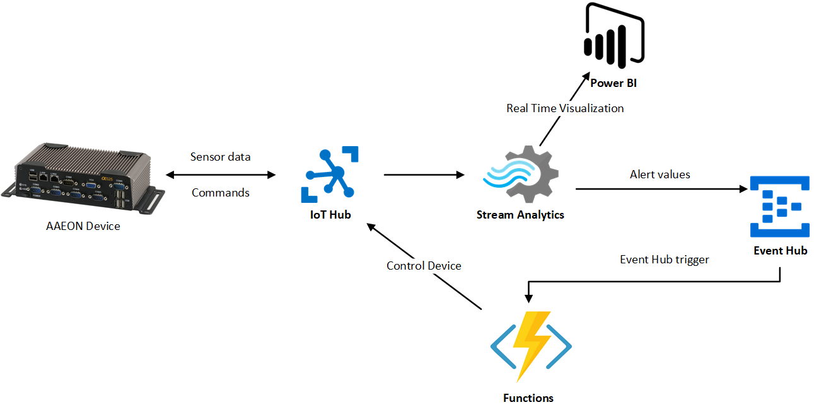

# Hands on lab objectives

In this hands on lab you will work with AAEON single boar computer, Sensirion sensors connected to this device and Azure Cloud Services. The main objectives will be to connect your device to cloud infrastructure, read and send sensor data to cloud to enable data processing and visualization in the cloud and finally built your own cloud infrastructure which will enable you to process the data, communicate and control the device and visualize data. Bellow you can find architecture of final solution:




## **1. Create simulated IoT device and connect it to IoT Hub**

We will start with creation of  simulated T device, which we will connect to cloud. More precisely it will be streaming random values - simulated sensor data to IoT Hub. This first challenge includes automated testing infrastructure. When you succeed you should see your device and messages that are sent by your device displayed within [this web page](https://soselectronic.azurewebsites.net/deviceexplorer).

To  complete the challenge, you will need to take following steps:

1. Git-clone code base from [this repository](https://github.com/MarekLani/SOSWorkshopCode), which includes logic of simulated device (*SensorDataSenderApp*) and will serve as a base solution we will extend in further challenges

2. Register your device within existing cloud infrastructure  by sending POST request to following endpoint:  https://soselectronic.azurewebsites.net/api/registerDevice . When registering device, you need to provide unique string ID for your device. We recommend to use your name when creating id for your device. Endpoint expects json payload to be sent within body part of request, so for your request you need to provide Content-Type header with value "application/json" and provide raw payload in following format:  

   ```json
   {"deviceId":"<yourDeviceId>"}
   ```

   As a response, you will be provided connection string, which you will use in the following step.  

   ```json
   {"DeviceConnectionString:":"HostName=soselectronics.azure-devices.net;DeviceId=<yourDeviceId>;SharedAccessKey=<deviceKey>"}
   ```

   To invoke POST request we recommend you to use [Postman](https://www.getpostman.com/) - tool for generating REST requests.

   After registering your device successfully, you now should see the device within [monitoring webpage](https://soselectronic.azurewebsites.net/deviceexplorer).

3. In third step you will need to alter application settings. To do so, open project you have cloned from github and navigate to appSettings.json file. Here you should alter value for "IoTHubConnectionString" field. Please provide device connection string received as a response in previous step. Your appSettings.json file should now look like this: 

   ```json
   {
     "ConnectionStrings": {
       "IoTHubConnectionString": "HostName=soselectronics.azure-devices.net;DeviceId=<yourDeviceId>;SharedAccessKey=<deviceKey>"
     },
     "SensorDataPath": "C:\\Users\\RestOfThePathToLogs"
   }
   ```

4. Start the application. Now your simulated devices started to send data to IoT Hub. It generates message every ten seconds and you can see their content being output to console window. Within monitoring webpage you should now already see the latest message that has been delivered to IoTHub.


## **2. Invoke direct method on simulated device**

In the second challenge we will add capabilities to our simulated device, so it can receive messages from cloud and invoke specific methods. This is suitable in scenarios of automation, when we want to control devices remotely.

1. To achieve this, add following code to the end of Main method of Program class, to register callback method.

   ```c#
   // Create a handler for the direct method call
   s_deviceClient.SetMethodHandlerAsync("StartAlarm", StartAlarm, null).Wait();
   ```

2. Now we need to implement our alert handling method. For now it has only simple logic, which is simple outputting of text to console window, to notify us, when the StartAlarm method was invoked. Later on we will extend this logic to control LED Diod connected to our physical device. Add following method to your Program class:

   ```c#
   private static Task<MethodResponse> StartAlarm(MethodRequest methodRequest, object userContext)
   {
       dynamic jsonObject = JsonConvert.DeserializeObject(methodRequest.DataAsJson);
       Console.WriteLine("ALARM CO2 :"+ (string)jsonObject.CO2);
   
       // Initiate alar for 5 seconds
       Task.Run(async () =>
                {
                    //SetDioPinState(0, 0, 1);
                    Console.WriteLine("Alarm START");
                    await Task.Delay(5000);
                    Console.WriteLine("Alarm STOP");
                    //SetDioPinState(0, 0, 0);
   
                });
   
   
       //respond to IoT Hub
       string result = "{\"result\":\"Executed direct method: " + methodRequest.Name + "\"}";
       return Task.FromResult(new MethodResponse(Encoding.UTF8.GetBytes(result), 200));
   }
   
   ```

Now when you run your application again, monitor values being sent to IoT Hub. If you see average for CO2 values in two subsequent messages is over 50, you should expect alarm method to be fired.

What happens on backend is, that cloud infrastructure detects alert condition, meaning average of two subsequent CO2 values sent by your device exceeds value of 50. In such case there is method invocation call generated by existing infrastructure. More precisely, the whole message processing and method invocation call process is as follows: 

   	1. Message from your device is sent to IoT Hub
 	2. All the messages received by IoTHub are continuously processed by Stream Analytics Job, which detect above stated alert condition
 	3. In case there is alert condition, there is message send to Event Hub
 	4. When message arrives to event hub it automatically triggers Azure Function, which then instructs IoTHub to send direct method call to your device

If you are interested in code for backend infrastructure, it can be found in [this repo](https://github.com/MarekLani/AzureIoTHubSignalRExplorer).

## **3. Reading and sending real sensor data**

In this challenge we will alter our existing application and prepare it for deployment onto AAEON single-board computer, so it collects and sends data from real sensors. This challenge consists of three parts: Setting up the real device and preparing it for data collection, altering of code of our application to read and resend real sensor data and deployment of application to AAEON device. 

### Setting up the real device

We will read data using Sensirion SGP sensor (capable to measure total volatile organic compounds in air and CO2 levels) and SHT sensor (capable to measure humidity and temperature). These sensors should be connected to SEK Sensor Bridge, which collects data from sensors and forwards those thru USB cable to AAEON computer. Physical setup should look like this:


In order to make the collection of sensor data work, we need to use Sensirion's Control Center, which provides necessary software layer, so our single board computer is capable to communicate with sensor bridge and thus receive messages. Before we will proceed to alter the application we will need to connect to our single board computer and change path where the sensor data will be collected. To do so, please connect to your device using Remote Desktop Connection. You should have been given login information, including IP address of your device, login name and password. After connecting to your device please open the Sensirion Control Center, which should already be installed on your device, go to *File -> Settings* and change the Output Directory path to C:\User\<useraccountonyourdevice>\data_logging. Store  this path as we will need it later when altering our application. Do not start the data collection yet. 


### Altering application code to read and send real sensor data

Now we should alter code of our application to read sensor data from the files where it is being output by Sensirion's Control Center software. Note, that after changes we will make, the app will no longer work on your development machine (unless you use method for sending simulated data, or you setup Sensirion Control Center on your computer, and connect Sensor Bridge to it as well). 

First we will need to alter application settings by providing correct path to directory where files with sensor data resides. Copy path to output directory and paste it to appSettings.json file:

```json
{
  "ConnectionStrings": {
    "IoTHubConnectionString": "HostName=soselectronics.azure-devices.net;DeviceId=<yourDeviceId>;SharedAccessKey=<deviceKey>"
  },
  "SensorDataPath": "C:\\Users\\<UserAccountOnYourDevice>\\data_logging"
}
```

Now add SendSensorData method to Program class:

```c#
 private static async Task SendSensorData(DeviceClient deviceClient)
 {
     string path = Environment.GetFolderPath(Environment.SpecialFolder.ApplicationData);

     Console.WriteLine(path);
     long oldLength = 0;

     var directory = new DirectoryInfo(configuration["SensorDataPath"]);

     //We will be reading from the most fresh files with sensor data
     var shtFile = (from f in directory.GetFiles()
                    where f.Name.Contains("SHT")
                    orderby f.CreationTime descending
                    select f).First();

     var sgpFile = (from f in directory.GetFiles()
                    where f.Name.Contains("SGP")
                    orderby f.CreationTime descending
                    select f).First();

     Console.WriteLine(shtFile.FullName);
     Console.WriteLine(sgpFile.FullName);
     DateTime lastSHTMeasurementTime = DateTime.MinValue;
     DateTime lastSGPMeasurementTime = DateTime.MinValue;

     SensorData sd = new SensorData();

     while (true)
     {
         bool newRecordsRead = false;

         var lastLine = ReadLastLine(shtFile.FullName);
         var sensorDataArray = lastLine.Split('\t');

         var lineTime = UnixTimeStampToDateTime(Convert.ToDouble(sensorDataArray[0]));

         //is there new data to read from SHT sensor
         if (lastSHTMeasurementTime < lineTime) {
             if (lineTime > sd.TimeStamp)
                 sd.TimeStamp = lineTime;

             lastSHTMeasurementTime = lineTime;
             sd.Temp = Convert.ToDouble(sensorDataArray[1]);
             newRecordsRead = true;
         }

         lastLine = ReadLastLine(sgpFile.FullName);

         sensorDataArray = lastLine.Split('\t');

         lineTime = UnixTimeStampToDateTime(Convert.ToDouble(sensorDataArray[0]));

         //is there new data to read from SGP sensor
         if (lastSGPMeasurementTime < lineTime)
         {
             if(lineTime > sd.TimeStamp)
                 sd.TimeStamp = lineTime;

             lastSGPMeasurementTime = lineTime;
             sd.CO2 = Convert.ToDouble(sensorDataArray[1]);
             newRecordsRead = true;
         }

         if (newRecordsRead){
             var message = JsonConvert.SerializeObject(sd);
             Console.WriteLine(message);
             await deviceClient.SendEventAsync(new Message(Encoding.ASCII.GetBytes(message)));
         }
         else
         {
             await Task.Delay(5000);
         }
     }
 }
```

This method monitors files with sensor data for changes and pulls out CO2 level and temperature value and send's it to cloud infrastructure. 

To make everything work, we need to add helper methods *ReadLastLine* and *UnixTimeStampToDateTime* to Program class, to be able to read last line from file and to convert Unix timestamp to C# DateTime representation. Here is to code:

```c#
 public static String ReadLastLine(string path)
 {
     return ReadLastLine(path, Encoding.ASCII, "\n");
 }

public static String ReadLastLine(string path, Encoding encoding, string newline)
{
    int charsize = encoding.GetByteCount("\n");

    byte[] buffer = new byte[charsize];

    using (FileStream stream = new FileStream(path, FileMode.Open, FileAccess.Read, FileShare.ReadWrite))
    {
        var length = stream.Length;
        stream.Seek(-10, SeekOrigin.End);

        while(encoding.GetString(buffer) != "\n")
        {
            stream.Seek(-2, SeekOrigin.Current);
            stream.Read(buffer, 0, 1);
        }
        buffer = new byte[length - stream.Position];
        stream.Read(buffer, 0, buffer.Length);         
    }
    return encoding.GetString(buffer);
}

public static DateTime UnixTimeStampToDateTime(double unixTimeStamp)
{
    // Unix timestamp is seconds past epoch
    System.DateTime dtDateTime = new DateTime(1970, 1, 1, 0, 0, 0, 0, System.DateTimeKind.Utc);
    dtDateTime = dtDateTime.AddSeconds(unixTimeStamp).ToLocalTime();
    return dtDateTime;
}
```

### Deploying application to AAEON device

To be able to run our application on the AAEON device, please build it in Release configuration (for x64 architecture). Now navigate to directory, where the projects was built. It should be in following directory: *Path_To_Project\SensorDataSender\bin\x64\Release* . Please copy this Release folder and paste in thru RDP connection to your AAEON device (for example onto Desktop). This will initiate upload of files to your device. Now you can start sensor data collection using Control Center. Simply click Start button. Once SensorDataSender application was copied to AAEON device, please open the folder, locate and run SensorDataSender.exe file. Now when you navigate to https://soselectronic.azurewebsites.net/deviceexplorer you should see messages and values coming from real sensors.

## 4. Responding to Alert messages

In this section we will slightly change behavior of our application in case of invocation of SetAlarm method thru IoT Hub direct method call capability. We will utilize capabilities to control external hardware connected to our AAEON device. In our case it will be LED DIOD. You should have your own diod connected to resistor and to DIO port connector, while diod is connected to GPIO PIN number 1. Connection to second PIN is used as grounding. 


Please mount DIO connector to DIO port on your AAEON device

Now we may alter the application to flash the diod in case of alert condition. We will make use of aaeonEAPI SDK, which was already attached to the application code. This SDK will help us to send signal to specific GPIO PIN of DIO port. As it is written in C++, we will need to use DLL Import instructs to make use of SDK in C# environment. We will also use status codes defined in EAPI.cs file.

First include following DLL Imports and variables right in the beginning of Program class:

```c#
public UInt32 nPinCount = 0;
public static int groupSelected = 1;
public UInt32 bDioDisable = 0;

[DllImport("aaeonEAPI.dll", EntryPoint = "EApiGPIOSetDirection")]
public static extern UInt32 EApiGPIOSetDirection(UInt32 Id, UInt32 Bitmask, UInt32 Direction);

[DllImport("aaeonEAPI.dll", EntryPoint = "EApiGPIOSetLevel")]
public static extern UInt32 EApiGPIOSetLevel(UInt32 Id, UInt32 Bitmask, UInt32 Level);

[DllImport("aaeonEAPI.dll", EntryPoint = "EApiLibInitialize")]
public static extern UInt32 EApiLibInitialize();

[DllImport("aaeonEAPI.dll", EntryPoint = "EApiLibUnInitialize")]
public static extern UInt32 EApiLibUnInitialize();
```

Now we will add helper method to Program class, thanks to which we will be able to control values on GPIO pins:

```C#
/// <summary>
/// Sets value on GPIO PIN
/// </summary>
/// <param name="dPin">number of pin</param>
/// <param name="nInput">iput/output  1/0</param>
/// <param name="nHigh">on/off 1/0</param>
public static void SetDioPinState(UInt32 dPin, UInt32 nInput, UInt32 nHigh)
{
    UInt32 err1 = EAPI.EAPI_STATUS_SUCCESS;
    UInt32 err2 = EAPI.EAPI_STATUS_SUCCESS;

    err1 = EApiGPIOSetDirection(EAPI.EAPI_GPIO_GPIO_ID((UInt32)(dPin + (8 * (groupSelected - 1)))), 0xFFFFFFFF, nInput);
    err2 = EApiGPIOSetLevel(EAPI.EAPI_GPIO_GPIO_ID((UInt32)(dPin + (8 * (groupSelected - 1)))), 0xFFFFFFFF, nHigh);

    if (err1 != EAPI.EAPI_STATUS_SUCCESS || err2 != EAPI.EAPI_STATUS_SUCCESS)
    {
        if (err1 == EAPI.EAPI_STATUS_DEVICE_NOT_READY || err2 == EAPI.EAPI_STATUS_DEVICE_NOT_READY)
        {
            Console.WriteLine( "Can't set DIO" + (dPin + 1 + (8 * (groupSelected - 1))).ToString() + " value:\nHardware not ready. Please check BIOS setting.");
        }
        else
        {
            Console.WriteLine("Can't set DIO value.");
        }
    }
}
```

Last thing we need to do is uncomment both SetDioPinState lines in StartAlarm method of Program class. It should now look like this:

```c#
private static Task<MethodResponse> StartAlarm(MethodRequest methodRequest, object userContext)
{
    dynamic jsonObject = JsonConvert.DeserializeObject(methodRequest.DataAsJson);
    Console.WriteLine("ALARM CO2 :"+ (string)jsonObject.CO2);

    // Initiate alar for 5 seconds
    Task.Run(async () =>
             {
                 SetDioPinState(0, 0, 1);
                 Console.WriteLine("Alarm START");
                 await Task.Delay(5000);
                 Console.WriteLine("Alarm STOP");
                 SetDioPinState(0, 0, 0);

             });


    //respond to IoT Hub
    string result = "{\"result\":\"Executed direct method: " + methodRequest.Name + "\"}";
    return Task.FromResult(new MethodResponse(Encoding.UTF8.GetBytes(result), 200));
}
```

As a last step repeat deployment process. Rebuild your solution for release configuration and copy files to your AAEON device. 

Now, start collecting sensor data thru Sensirion Control Center and you start Sensor Data Sender application. When you start breathing on your CO2 sensor to increase CO2 level, you should see led diod flashing from time to time, because cloud infrastructure evaluates increased CO2 levels as an alert event. 

Now as a next steps, we will move from device side to backend part and we will try to implement Azure backend, so our solution is not dependent on existing pre-build infrastructure.

## 5. Building Azure backend

This challenge will contain several steps. We will start with creation of IoT Hub, then we will create Azure Stream Analytics Job, which will forward data to Power BI service for visualization purposes and it will also determine alert conditions, which will be forwarded to Event Hub and processed by Azure Function. We are stating final architecture once again:


We will be creating this resources using Azure Portal. Please login to [Azure Portal](https://portal.azure.com)  using your Microsoft Account, for which you have activated Azure subscription.

### 5.1 Creating IoT Hub and connecting your application

The first step is to use the Azure portal to create an IoT hub in your subscription. The IoT hub enables you to ingest high volumes of telemetry into the cloud from many devices. The hub then enables one or more back-end services running in the cloud to read and process that telemetry.

1. Sign in to the [Azure portal](http://portal.azure.com).
2. Select **Create a resource** > **Internet of      Things** > **IoT Hub**.


3. In the **IoT hub** pane, enter the following information for your IoT hub:

1. - **Subscription**: Choose the subscription that you want to use to create this IoT hub.
   - **Resource group**:  Create a resource group to contain the IoT hub or use an existing one. By       putting all related resources in a group together, such as **TestResources**, you can manage them all together. For example, deleting the resource       group deletes all resources contained in that group. For more information, see [Use resource groups to manage your Azure resources](https://docs.microsoft.com/en-us/azure/azure-resource-manager/resource-group-portal).
   - **Region**: Select the closest location to your devices.
   - **Name**: Create a unique name for your IoT hub. If the name you enter is       available, a green check mark appears.
   - Important

   - The IoT hub will be publicly discoverable as a DNS endpoint, so make sure to avoid any sensitive information while naming it.


4. Select **Next: Size and scale** to continue creating your IoT hub. 

5. Choose your **Pricing and scale tier**. For this article, select the **F1 - Free** tier if it's still available on your      subscription. For more information, see the [Pricing and scale tier](https://azure.microsoft.com/pricing/details/iot-hub/).


6. Select **Review + create**.

7. Review your IoT hub information, then click **Create**.  Your IoT hub might take a few minutes to create. You can monitor the progress in the **Notifications** pane.

8. Once IoT Hub is deployed, we need to create identity for our device. To do so, navigate to your newly create IoT Hub resource go to IoT devices blade, click Add, provide Device ID for your device and click save.

   

9. To obtain connection string for your device, click on your device in the list of devices on IoT Devices blade and copy the connection string for your device.

   

10. Now go to Sensor Data Sender application, change IoT Hub connection setting in appSetting.json file, rebuild your solution, go to release folder copy the appSettings file and paste it to your AAEON device. Now when you run application, it will be sending messages to your newly created IoT Hub. In the next steps we will work on processing and visualization of those messages.

### 5.2 Creating Power BI Account

For further needs we will create Power BI account. Power BI is Business Intelligence visualization tools, which provides rich data visualization capabilities across various scenarios, not necessarily only for business data. To create account follow these steps:

1. Navigate to http://www.powerbi.com

2. Hit *"Start free"* button

   

3. Activate Power BI Pro 60 day free trial by clicking *"TRY FREE"* button

   

   ​

4. Provide work email address (Note: outlook, gmail, yahoo etc. address won't work), hit Sign up and finish registration process

   


### 5.3 Creating and configuring Azure Stream Analytics job to perform real time processing

In this step we will create Azure Stream Analytics Job, which enables us to examine high volumes of data streamed from devices or processes, extract information from that data stream, identify 
patterns, trends, and relationships. These patterns can be subsequently used to trigger other
processes or actions, like alerts, automation workflows, feed information to a reporting tool, or stored for later investigation.  

Before we start with the creation of Stream Analytics Job we will alter configuration of our IoT Hub and we will create new Consumer groups, so our services, which read messages from IoT Hub do not steal those from each other. To add consumer groups follow these steps:

1. Navigate to your IoT Hub in Azure Portal

2. Click Endpoints, select Events and add "*StreamAnalytics*" and "Functions" consumer group and finally hit Save.

   

#### Creating Azure Stream Analytics Job:

1. Navigate to Azure Portal

2. Hit Create Resource, navigate to Internet of Things category of services and select Stream Analytics Job

   

3. Give name to your Stream Analytics Job, select Resource group (preferably the same one you that you have created IoT Hub in), select location (again preferably the same one as for IoTHub) and hit Create. This will start provision of your Stream Analytics resource, what should take few seconds

   


#### Configure Azure Stream Analytics Job to receive messages from IoT Hub, process them and output to Power BI as a streaming dataset in real time visualization

1. First we will need to create Input. To do so, navigate to newly created Azure Stream Analytics job, select Inputs and click Add stream input and choose IoT Hub.

   

   ​

2. In New Input form provide Input alias as IoTHubInput, set Source to IoT hub, choose IoT hub you have created in first part of this workshop and change Consumer group from $default to "*StreamAnalytics*" and hit Create.

   

3. Now we will add Power BI output. This is why we have activated Power BI account. We need to create Power BI output where Stream Analytics will be pushing data. To achieve this navigate again to Azure Stream Analytics Job and click Outputs -> Add and select Power BI type.

   

4. Name your output *"pbi"*. Provide name for Dateset that will be created in Power BI and also for data table. Subsequently click Authorize, to connect to your previously creaed Power BI account and login with your wokr account.

   

5. After authorization went thru successfully set Group workspace value to My Workspace and click save.

   

6. As last step we need to create query which determines how the incoming messages will be processed. For now we will create only very simple query which will forward all the messages to Power BI. Later we will add logic, to recognize alert conditions. 

   

7. Insert following code to query window and hit Save.

   ```sql
   SELECT
       *
   INTO
       pbi
   FROM
       IoTHubInput
   ```

8. We are done configuring Azure Stream Analytics Job and now we only need to run it. To achieve that navigate to Overview of your job and hit Run, select Now and Start.

   

   ​

   

   ​

We have create basic query, which forwards data to Power BI. We will add bit more advanced queries in further parts of this workshop. Azure Stream Analytics provides much more sophisticated querying capabilities. You get examine those in documentation: 

Azure Stream Analytics Windowing: https://msdn.microsoft.com/en-us/library/azure/dn835019.aspx

Azure Stream Analytics Aggregation Functions: https://msdn.microsoft.com/en-us/library/azure/dn931787.aspx

Azure Stream Analytics Common Usage Patterns: https://docs.microsoft.com/en-us/azure/stream-analytics/stream-analytics-stream-analytics-query-patterns

### 5.4 Creating data visualization with Power BI

To show near real time data stream coming from our sensor data sender application we utilize Power BI. Before we start please run your application so it generates messages which will flow thru IoT Hub, Stream Analytics Job down to Power BI. 

1. Navigate to http://ww.powerbi.com and sign in using your credentials

   

2. Click "*My Workspace*" hit Create in right upper corner and select Dashboard

   

3. Name your Dashboard and click Create

   

4. In next step click Add tile and then select CUSTOM STREAMING DATA and proceed by clicking Next

   

5. Select IoTWorkshop streming dataset and hit Next

   

6. In this step we will define how the visualization will look like. We set Line chart as a Visualization Type. For Axis we will choose ts field (timestamp) and avgtemp for Values. We will display window for last 5 minutes. Proceed by clicking Next

   

7. Now we will provide Title for out visualization, click Apply, and we are able to observe average temperature measured by our simulated device in almost real time.

   

8. Visualization of data should look something like this:

   

   ​

Similar as other services we worked with today also Power BI provides much richer set of functionality as we were able to touch this workshop. Power BI enables you to create and share data visualization of various kind from various data sources, whether it is relational, non relational, nosql or simple csv file store in your datacenter, in Azure or in other clouds. To find out more about this service please visit: https://powerbi.microsoft.com/en-us/documentation/powerbi-service-get-started/

### 5.5 Implementing alerting logic

To implement alerting logic, which will remotely control LED Diod we will add new logic to our Stream Analytics query. This logic will determine, whether there was 30 second window with average CO2 level over 50. If so it will send message to Event Hub (queuing service). We will use message arrival to Event Hub event as a trigger for Azure Function, which will further instruct IoT Hub to invoke direct method on the IoT Device.

#### Creation of Event Hub

To create event hub, please follow these steps:

1. Click + Crate a resource, go to Internet of Things, choose Event Hubs and finally click create

   

2. Choose unique name for your namespace, Set pricing tier to Basic, select your resource group and Location to same one as previously for IoTHub and Stream analytics and hit create.

   

3. Now we have created namespace for our future event hubs, and now we need to create event hub instance. To do so navigate to newly created resource and hit + Event Hub

   

4. Name your event hub and click create

   


#### Add Event Hub output to Stream Analytics Job

Now when you have create Event Hub, we can alter Azure Stream Analytics job to send messages to this event hub. First we need to add output to Stream Analytics. To do so navigate to Stream Analytics -> Outputs (Note: to alter job you need to stop it first). Click Add Output and choose Event Hub


Set alias to alerteh and select service bus namespace and event hub you have created and click save: 


Subsequently you can alter the job query like this:

```sql
SELECT
    *
INTO
    pbi
FROM
    IoTHubInput

  
SELECT AVG(CO2) as avgco2, IoTHub.ConnectionDeviceId as deviceId INTO alerteh FROM IoTHubInput GROUP BY SlidingWindow(second,30), IoTHub.ConnectionDeviceId HAVING avgco2 > 50 
```

Now you can start the Stream Analytics job again.

### Implementing Azure Function for processing alert events

In this step we will use second project cloned from Github code repository. Namely is is Alert Processing project. Please open it in Visual Studio. Note that you need to have dev tools for Functions installed, for more details see: https://docs.microsoft.com/en-us/azure/azure-functions/functions-develop-vs

As a first step we will explore the code: 

```c#
public static class AlertProcessingFunction
{
    [FunctionName("AlertProcessingFunction")]
    public static async Task Run([EventHubTrigger("alerteh", Connection = "EventHubConnectionString")]string myEventHubMessage, ILogger log)
    {
        try
        {
            var s_serviceClient = ServiceClient.CreateFromConnectionString(System.Environment.GetEnvironmentVariable(
                "IoTHubConnectionString", EnvironmentVariableTarget.Process));

            dynamic jsonObject = JsonConvert.DeserializeObject(myEventHubMessage);

            var methodInvocation = new CloudToDeviceMethod("StartAlarm") { ResponseTimeout = TimeSpan.FromSeconds(30) };
            methodInvocation.SetPayloadJson(@"{""CO2"":""" + (string)jsonObject.avgco2 + @"""}");
            //methodInvocation.SetPayloadJson("10");
            // Invoke the direct method asynchronously and get the response from the simulated device.
            var response = await s_serviceClient.InvokeDeviceMethodAsync((string)jsonObject.deviceid, methodInvocation);

            log.LogInformation("Response status: {0}, payload:", response.Status);
            log.LogInformation(response.GetPayloadAsJson());
        }
        catch (Exception e)
        {
			 log.LogInformation(e.Message);
        }
    }
}
```

Our Azure Function is triggered by new message arriving to alert Event Hub. Within processing logic, it creates IoT Hub service client, which is later used to perform direct method invocation on connected IoT Device, while it is setting the json payload to include observed average value of CO2 so the device can display this information as well. 

We have two options how to run this function. It is possible to run it locally on our development machine or we can create Function App in Azure. We will try both approaches.

**Running alert processing function locally **

To run locally we will need to change connection strings, so our function connects to correct Event Hub and IoT Hub. 

Open local.settings.json file where you put application settings which get used when running function localy. 

First we will set value for EventHubConnectionString key. To locate Event Hub namespace connection string, please navigate to your Event Hub namespace (not event hub itself!), go to Shared access policies select *RootManageSharedAccessKey* and copy connection string-primary key.

 


Next we will set value for *IoTHubConnectionString* key. To locate it's value navigate to your IoT Hub resource. Open Shared access policies blade and select *iothubowner*.


Copy the Connection string and paste it to settings file.


Now you are ready to run alert processing function locally. Press run in viual studio and wait for alert processing method being invoked on your device. (Note if you used different name for your Even Hub, you will need to provide this name as a parameter instead of "alerteh" name used in code. This parameter is stated within trigger definition)

```c#
[FunctionName("AlertProcessingFunction")]
public static async Task Run([EventHubTrigger("alerteh", Connection = "EventHubConnectionString")]string myEventHubMessage, ILogger log)
```

**Deploying alert processing function to Azure**

First we will need to create function app, that will be used for deployment of our code. To do so, in Azure Portal click +Create Resource and navigate to Web category and select Function App.

 


Now we need to provide few settings. You should provde name for your function app (it should be unique name). Next select existing resource group, keep OS set to Windows and Hosting Plan to Consumption plan. Select Location to same region as previously created resources. Leave rest to default values and click Create.

After Function App is created we need to change and add few settings. 


Next we need to add connection strings to Function app's application settings as the app settings file is used only for local development. To do so, again navigate to your function app, click Application settings and add key value pairs for Event Hub and  IoT Hub connection strings. Use following names for the newly creted keys:  *EventHubConnectionString* and *IoTHubConnectionString*. Use the same values for these keys as before.


To save settings click Save button on top of application settings card.


Now we are ready to publish our Alert Function code to Azure. Go back to visual studio, right click Alert Processing project (not solution) and select publish.


Now select existing Azure App Service option and click Publish


In the list of App Services you should see your Function App. Select it and click OK. Now your code will be published to Azure. Once deploy finishes, you will again see alert method being invoked on your device. 


Congratulations! You know have successfully finished workshop challenges. Bellow we are stating links to documentation related to services, we have worked with today, where you can find more details about the services. 

